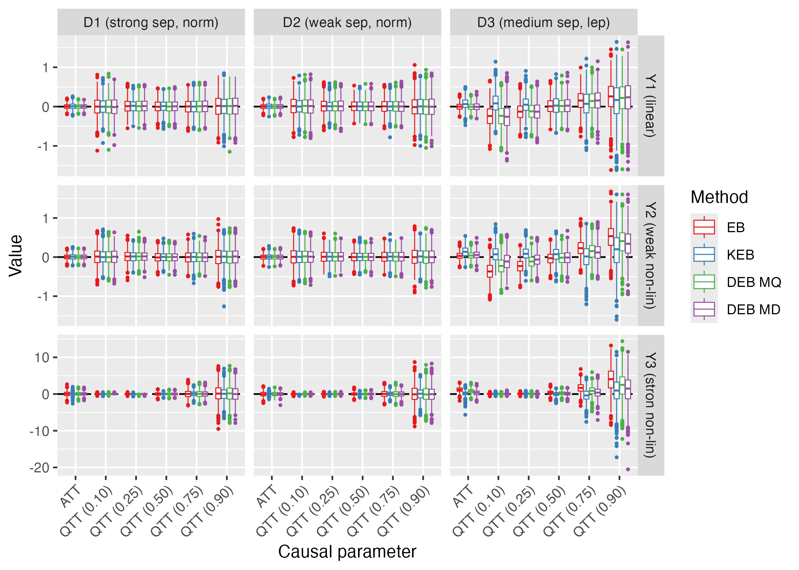
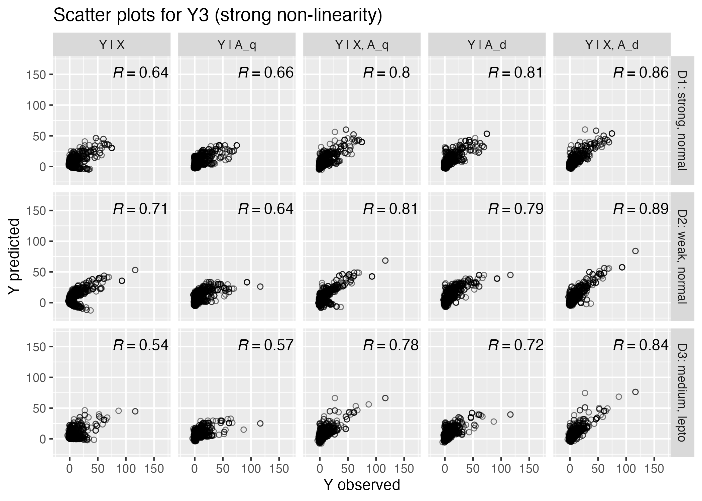

# Repository for the paper “Survey calibration meets observational studies: a simple method to balance covariate distributions”

# Acknowledgements

This work was financed by the National Science Centre in Poland, OPUS 22
grant no. 2020/39/B/HS4/00941.

# Reproduction of the results

## Setup

Install relevant packages for the paper. The `jointCalib` package is
available at CRAN but we install the package from github (development
version). The `IPS` package used in the [Sant’Anna et
al. (2022)](https://onlinelibrary.wiley.com/doi/10.1002/jae.2909) and
the `kbal` package used in the [Hazlett
(2020)](https://www3.stat.sinica.edu.tw/statistica/j30n3/J30N32/J30N32.html)
are available only on github.

``` r
install.packages(c("remotes", "ebal", "mvnfast", "data.table", "ggplot2", "laeken", "xtable", "glue", "stringr"))
remotes::install_github("ncn-foreigners/jointCalib@dev")
remotes::install_github("chadhazlett/KBAL")
remotes::install_github("pedrohcgs/IPS") 
```

## Notebooks and results

- Notebooks:
  - [simulation 1
    (EB)](https://htmlpreview.github.io/?https://raw.githubusercontent.com/ncn-foreigners/paper-note-quantiles-obs-studies/main/codes/1-simulation-eb.html),
  - [simulation 2
    (CBPS)](https://htmlpreview.github.io/?https://raw.githubusercontent.com/ncn-foreigners/paper-note-quantiles-obs-studies/main/codes/2-simulation-ps.html)
  - [processing results for the
    paper](https://htmlpreview.github.io/?https://raw.githubusercontent.com/ncn-foreigners/paper-note-quantiles-obs-studies/main/codes/3-report-results-mc.html)
  - [simulation 3 (why it
    works)](https://htmlpreview.github.io/?https://raw.githubusercontent.com/ncn-foreigners/paper-note-quantiles-obs-studies/main/codes/4-why-it-works.html)
- Simulation results may be found in folder `results/`
- Tutorial for [the `jointCalib` package]()
- Codes for the proposed method in [`Stata` and `Python`]()

## Highlights

### Results for the distributional entropy balancing (DEB)



### Results for the distribution balancing propensity score (DBPS)


### Why it works?

Including quartiles ($A_q$) and deciles ($A_d$) along with X makes the
relationship more linear and thus improves the estimates as EB and CBPS
assumes linear relationship between Y and calibration / balance
variables.



